# 📄 Informações do Projeto
`👨‍💻 CodeFlix`  

`📚 Trabalho interdisciplinar de aplicações web` 

## 🧑 Participantes

> - Yuri Rousseff
> - Luiz Felipe Goncalves
> - Rafael Mortimer Colares
> - Eduardo Lemos Paschoalini
> - Fernando Araújo Maia Machado

# Estrutura do Documento

- [Informações do Projeto](#informações-do-projeto)
  - [Participantes](#participantes)
- [Estrutura do Documento](#estrutura-do-documento)
- [Introdução](#introdução)
  - [Problema](#problema)
  - [Objetivos](#objetivos)
  - [Justificativa](#justificativa)
  - [Público-Alvo](#público-alvo)
- [Especificações do Projeto](#especificações-do-projeto)
  - [Personas e Mapas de Empatia](#personas-e-mapas-de-empatia)
  - [Histórias de Usuários](#histórias-de-usuários)
  - [Requisitos](#requisitos)
    - [Requisitos Funcionais](#requisitos-funcionais)
    - [Requisitos não Funcionais](#requisitos-não-funcionais)
  - [Restrições](#restrições)
- [Projeto de Interface](#projeto-de-interface)
  - [User Flow](#user-flow)
  - [Wireframes](#wireframes)
- [Metodologia](#metodologia)
  - [Divisão de Papéis](#divisão-de-papéis)
  - [Ferramentas](#ferramentas)
  - [Controle de Versão](#controle-de-versão)
- [**############## SPRINT 1 ACABA AQUI #############**](#-sprint-1-acaba-aqui-)
- [Projeto da Solução](#projeto-da-solução)
  - [Tecnologias Utilizadas](#tecnologias-utilizadas)
  - [Arquitetura da solução](#arquitetura-da-solução)
- [Avaliação da Aplicação](#avaliação-da-aplicação)
  - [Plano de Testes](#plano-de-testes)
  - [Ferramentas de Testes (Opcional)](#ferramentas-de-testes-opcional)
  - [Registros de Testes](#registros-de-testes)
- [Referências](#referências)

# Introdução

## 🟥 Problema

**Falta de conteúdo gratuito** e de qualidade sobre programação para espectadores brasileiros. Embora excelentes iniciativas (i.e. freeCodeCamp) existam no exterior, projetos similares ainda **carecem no Brasil.**

## 🙌 Objetivos

**Ampliar o acesso** à conteúdo sobre programação para jovens brasileiros que desejam aprender a programar. **BOM CONTEÚDO**, devemos ressaltar.

## ❓ Justificativa

Embora exista uma singela quantidade de conteúdo gratuito sobre programação para iniciantes lusófonos, eles encontram-se, majoritariamente, dispersos pela web. Um dos objetivos da plataforma é centralizar todo o conteúdo em um lugar só, de modo a facilitar o processo de aprendizagem.

## 📅 Público-Alvo

Jovens brasileiros de **todas as idades**, que querem aprender programação sem **nenhum custo**.

# Especificações do Projeto

## 🥼 Personas

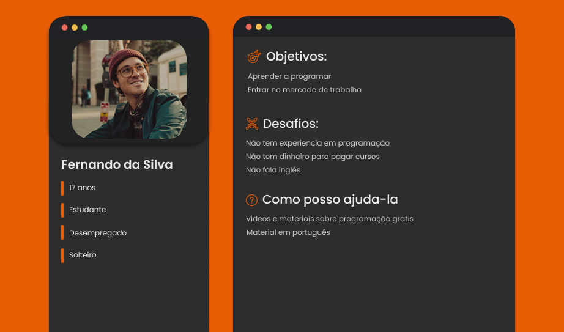
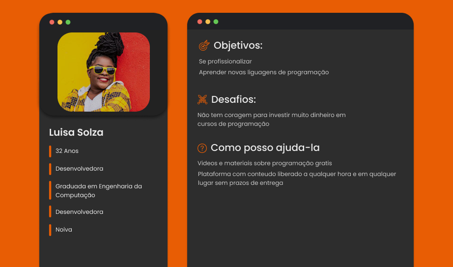
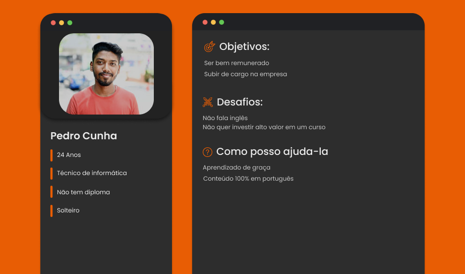

## 🧪 Mapas de Empatia

**Fernando da Silva**
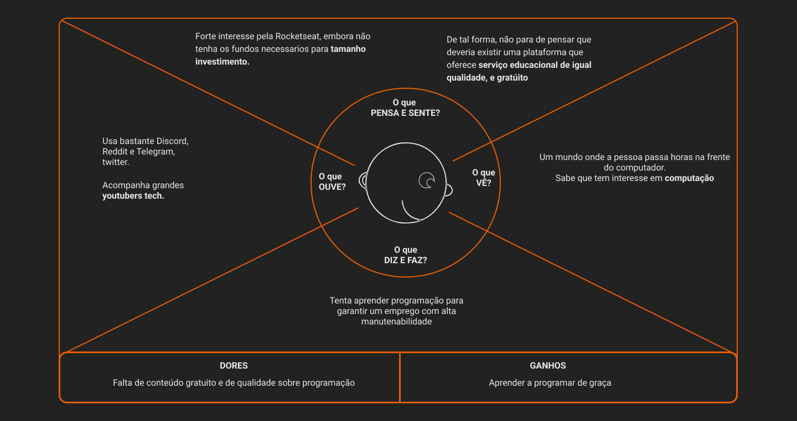
**Luisa Solza**
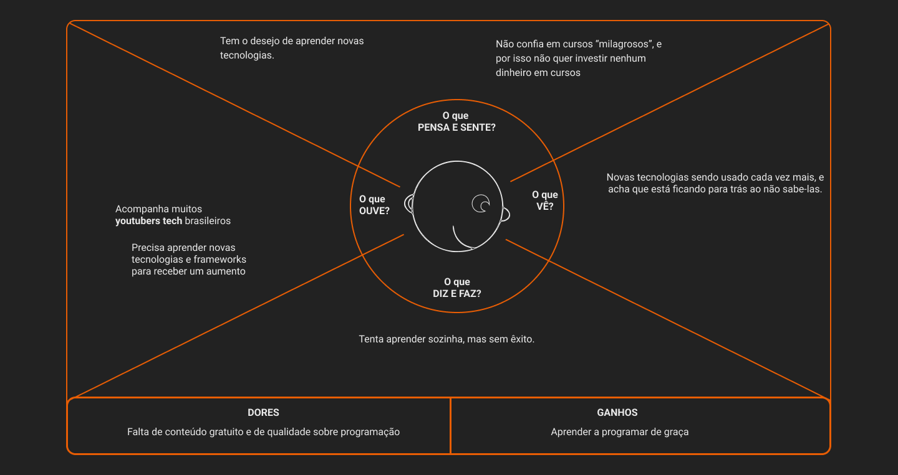
**Pedro Cunha**
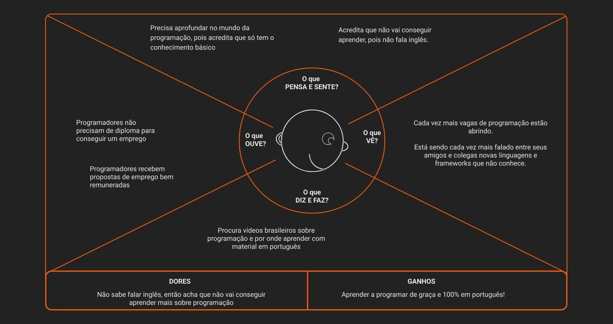

## 🏠 Histórias de Usuários

Com base na análise das personas forma identificadas as seguintes histórias de usuários:

|EU COMO... `PERSONA`| QUERO/PRECISO ... `FUNCIONALIDADE`        |PARA ... `MOTIVO/VALOR`                 |
|--------------------|-------------------------------------------|----------------------------------------|
|Quandale dingle     | Aprender a programação de graça           | Não gastar dinheiro e economizar       |
|Pedro OSalve        | Achar um curso de programação em português| Não sei falar em ingles                |
|Luana Santos        | Saber programar sem nenhum custo            | A vaga que eu quero precisa de conhecimento  em programação|
|Isadora Guimaroes   | Saber o básico de programação             | Ter uma renda extra como freelancer  |

## 🎍 Requisitos

As tabelas que se seguem apresentam os requisitos funcionais e não funcionais que detalham o escopo do projeto.

### 🎡 Requisitos Funcionais

|ID    | Descrição do Requisito  | Prioridade |
|------|-----------------------------------------|----|
|RF-001| Acompanhar o progresso do usuário ao longo do tempo | ALTA | 
|RF-002| Implementar exercícios para que o aluno pratique   | MÉDIA |
|RF-003| Fórum de discussões abaixo dos vídeos  | MÉDIA |
|RF-004| Acrescentar uma meta diária/semanal do aluno  | MÉDIA |
|RF-005| Gamificação do conteúdo  | BAIXA |
|RF-006| Conteúdos textuais e áudio-visuais  | ALTA |
|RF-007| Implementar Anúncios  | ALTA |
|RF-008| Área de avaliação dos cursos  | BAIXA |

### 🧱Requisitos não Funcionais

|ID     | Descrição do Requisito  |Prioridade |
|-------|-------------------------|----|
|RNF-001| É necessário um sistema de responsividade para diversos tamanhos de tela | MÉDIA |
|RNF-002| O sistema deverá apresentar um banco de dados para se comunicar | ALTA |
|RNF-003| O sistema necessita de executabilidade em qualquer plataforma | ALTA |
|RNF-004| Precisa de uma disponibilidade baseada na regra dos 5 noves | ALTA |
|RNF-005| Será feito um relatório de acompanhamento semanalmente | BAIXA |
|RNF-006| Necessidade de atender às normas legais | ALTA |
|RNF-007| Processamento de requisições do usuário em baixa latência | MÉDIA |

## ⚠ Restrições

O projeto está restrito pelos itens apresentados na tabela a seguir.

|ID| Restrição                                             |
|--|-------------------------------------------------------|
|01| O projeto deverá ser entregue até o final do semestre |
|02| Não pode ser desenvolvido um módulo de backend        |
|03| O projeto so pode ter a participacao de no maximo 6 pessoas|
|04| O projeto tem que ser desenvolvido apenas nas seguintes linguagens: HTML, CSS e JavaScript|
|05| O projeto deve ser feito atraves da metodologia agile |
|06| O projeto devera conter 4 sprints                     |
|07| O projeto deve ter um video de apresentacao da plataforma|
|08| O projeto deve seguir convenções de codificação e padrões bem estabelecidos  |
|09| O projeto deve ser versionado utilizando o controle de versão Git  |
|10| Todos os desenvolvedores deverão submeter pull-requests para a avaliação de, no mínimo, dois outros pares |

# 🎨 Projeto de Interface

O foco da interface, além de **responsividade** será a facilidade da utilização da mesma. Utilizando tecnicas de UX design, entendendo o comportamento do usuário, removendo quaisquer obstáculos. 
Fizemos o wireframe de média fidelidade, já demonstrando a paleta de cor, mas por enquanto sem seguir a técnica 60/30/10.
Para o design final, utilizaremos o plugin *Visual Eyes* no figma, que é um plugin que com a ajuda de inteligência artificial, prevê a visão do usuário "escaneando" a interface. Seguindo a regra que os usuários não leem o site, mas sim, o escaneiam, deixamos bem claro os CTA's e funções mais importantes.

## 🚗 User Flow

 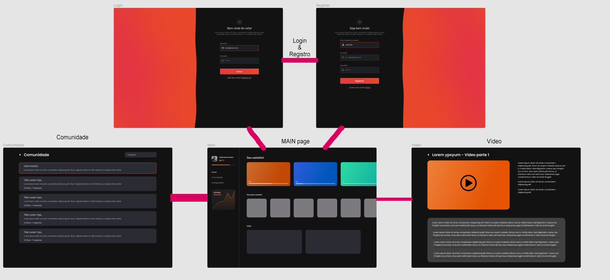

## 📨 Wireframes

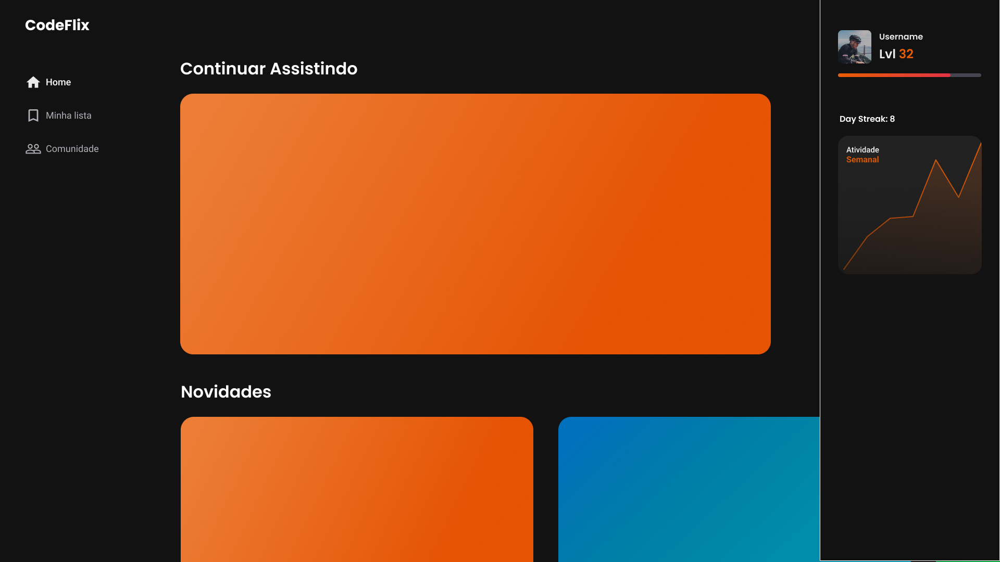

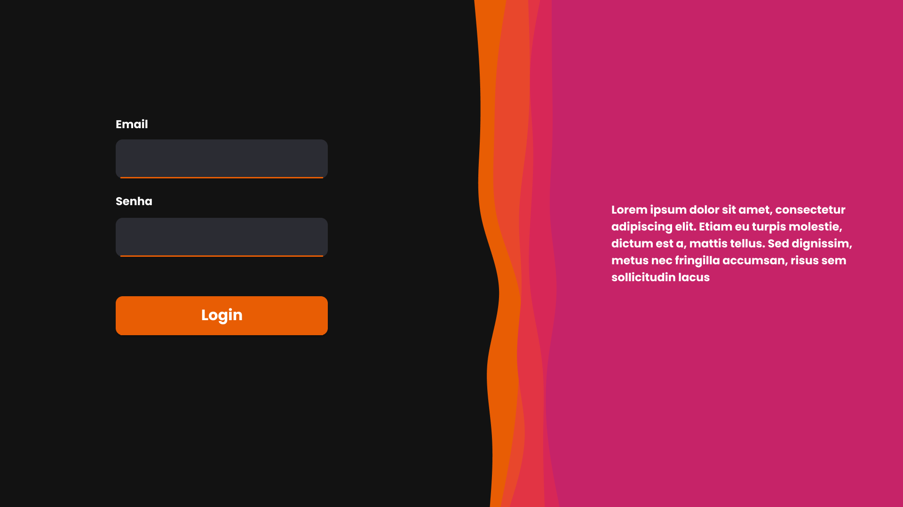

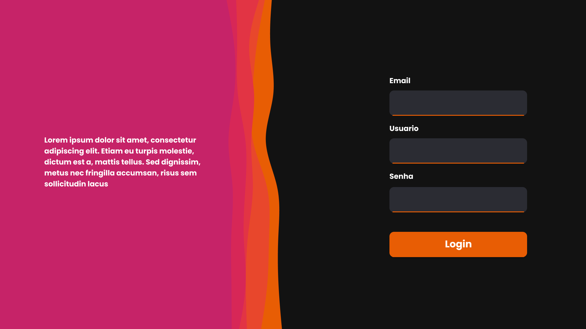

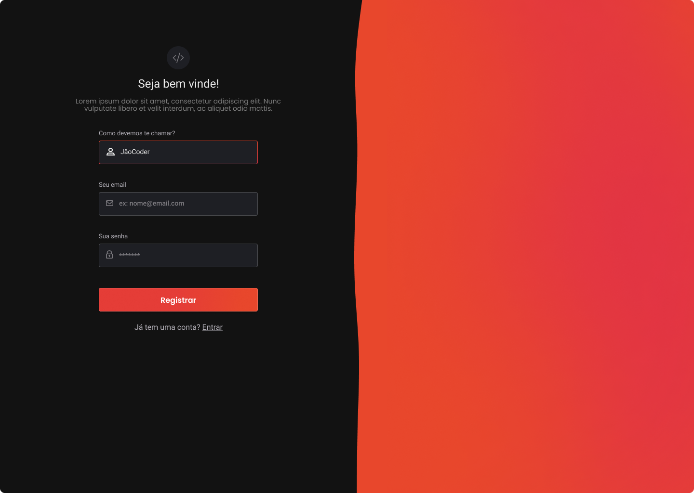

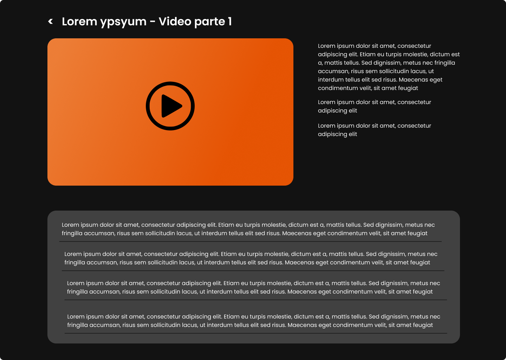

## 🚠 Protótipo interativo
https://www.figma.com/proto/8834otwtowQNY0KO9pTK7P/Codeflix?node-id=503%3A3188&scaling=min-zoom&page-id=7%3A3236&starting-point-node-id=503%3A3188

# 🔥 Metodologia
Para a nossa organização, utilizamos o Trello.
E nossas reuniões foram feitas no discord por volta de 4 dias na semanas, 20 minutos cada meeting. 

## 📃 Divisão de Papéis

| Aluno  | Função              |
|-----------|-------------------------|
|Yuri Rousseff  | Design & Organiza funções e horários |
| Eduardo Lemos | Front-End | 
| Rafael | Auxilia nos termos técnicos e programação front-end |
| Luiz | Cria novas features e ajuda no front-end |
| Fernando | Front-End |

## 🔨 Ferramentas

| Ambiente  | Plataforma              |Link de Acesso |
|-----------|-------------------------|---------------|
|Processo de Design Thinkgin  | Miro |  https://miro.com/XXXXXXX | 
|Repositório de código | GitHub | https://github.com/XXXXXXX | 
|Hospedagem do site | Netlify |  https://XXXXXXX.herokuapp.com | 
|Protótipo Interativo | Figma | https://figma.com/XXXXXXX | 

> As ferramentas empregadas no projeto são:
> 
> - Visual Studio Code (VSCode).
> 
> A IDE Visual Studio Code, foi escolhida pela facil integração com o GitHub,
> também pelas quantidades de plugins que ajudam no desenvolvimento do projeto.

## Controle de Versão

O Git foi o software de controle de versão escolhido. O repositório Git é hospedado no GitHub.

Como o projeto em questão é relativamente pequeno, optamos pela não introdução de metodologias mais bem formuladas (tais como [Git Flow](https://www.atlassian.com/br/git/tutorials/comparing-workflows/gitflow-workflow) ou [Desenvolvimento Baseado em Tronco](https://www.atlassian.com/br/continuous-delivery/continuous-integration/trunk-based-development)) para economizarmos tempo ao não lidar com as burocracias introduzidas por tais modelos.

Evidentemente, dado um eventual escalonamento no escopo e tamanho do projeto, não teremos outra opção senão introduzir um modelo mais adequado a essa eventual crescente complexidade.

Por ora, todavia, foi resolvido adotar este modelo:
- Manutenção de uma branch `main`, a partir da qual novos deploys do site serão feitos. Tais deploys podem ser feitos automaticamente através de integração com o Netlify.
- Cada nova feature é introduzida em uma branch separada, que poderá ser unificada à `main` através da solicitação de _pull requests_, que deverão ser revisados por, _no mínimo_, **dois** outros integrantes do grupo. Este requerimento pode ser imposto através das configurações do repositório.
- A branch `main` é protegida, isto é, não é possível modificá-la diretamente.

Eventuais _bugs_ ou _feature-requests_ devem ser registrados no _issue tracker_ do repositório GitHub. As tags utilizadas devem ser, respectivamente, `bug` e `feature-request`.

Introduziremos _workflows_ utilizando GitHub Actions para testar o código. Inicialmente utilizando ferramentas de análise semântica (i.e. ESLint) e sintática (i.e. Prettier). Eventualmente, se testes forem introduzidos, também serão verificados nessa etapa. Para que uma PR possa ser aprovada, tal _workflow_ deve suceder.

# **############## SPRINT 1 ACABA AQUI #############**

# Projeto da Solução

Criar uma plataforma que possui cursos de programação gratis para pessoas com baixa renda.

## Tecnologias Utilizadas

Foram utilizados os seguintes conceitos e tecnologias:
Conceito de gameficação para aumentar o engajamento do usuário com o site.
Conteúdos visuais e áudio-visuais.
Conceito UX design foi utilizado no desenvolvimento do front end.
Foi utilizada o Visual Eyes, sendo uma inteligência artificial que prevê para onde o usuário olhará no seu site.
Foi utilizada a plataforma netlify para hospedar o site.

🌠 Linguagens utilizadas na criação do site:
HTML
CSS
JavaScript

## Arquitetura da solução

Navegador:
HTML + CSS + JavaScript
Local Storage

Internet

Hospedagem:
Netlify
> Inclua um diagrama da solução e descreva os módulos e as tecnologias
> que fazem parte da solução. Discorra sobre o diagrama.
> 
> **Exemplo do diagrama de Arquitetura**:
> 
> 

# Avaliação da Aplicação

Foram criados planos de testes para apresentar o funcionamento das situações requisitadas e restritas do projeto, a separação entre testes diferentes se mostra um conhecimento útil para os desenvolvedores, que precisam saber o que pode ocorrer na interação do usuário com o site.

## Plano de Testes

## Testes validar a seção de comunidades

### Teste 1 - Ver Página Principal

- ***Pré condições:*** Página "comunidade" completa.
- ***Ações:***
    - Acessar a página da comunidade
- ***Resultado esperado:***
    - A página da comunidade deve mostrar todos os tópicos existentes, permitindo o acesso individual a cada um deles. Deve também mostrar um link para criar um novo tópico.

### Teste 2 - Criar Tópico

- ***Pré condições:*** Página "comunidade" completa.
- ***Ações:***
    - Acessar a página para criar tópicos.
    - Completar todos os campos exigidos pelo formulário.
    - Submeter.
- ***Resultado esperado:***
    - No caso de todos os campos do formulário terem sido preenchidos corretamente, o tópico deve ser criado e o usuário, redirecionado à página principal da comunidade, de modo que o novo tópico será mostrado na última posição.

### Teste 3 - Criar Tópico: ERRO

- ***Pré condições:*** Página "comunidade" completa.
- ***Ações:***
    - Acessar a página para criar tópicos.
    - Tentar criar um novo tópico com qualquer um dos campos em branco.
    - Submeter.
- ***Resultado esperado:***
    - No caso em que qualquer um dos campos do formulário não tiver sido devidamente preenchido, a submissão do formulário deve falhar, com a devida mensagem de erro mostrada ao usuário.
    - Com o erro, o usuário tem a possibilidade de corrigir os campos inválidos e submeter o formulário de modo correto.

### Teste 4 - Apagar tópico

- ***Pré condições:*** Página "comunidade" completa.
- ***Ações:***
    - Na página de apagar tópico, clicar no botão “Apagar Tópico”.
- ***Resultado esperado:***
    - Ao apagar um tópico, o usuário é redirecionado à página principal da comunidade.
    - Essa operação não falha tendo em vista que, se o usuário tentar apagar um tópico que não existe, nada acontece (o utilizador é apenas redirecionado à página principal da comunidade).

---

## Testes da seção da página de visualizar vídeo

### **Teste 1 - O botão já foi marcado?**

O primeiro teste deste componente de curtida é testar se o botão já foi clicado pelo usuário.

- ***Pré condições:*** O JavaScript deve estar funcional.
- ***Ações:***
    1. Acessar a página
        - Clicar no botão de curtida de algum comentário
        - Trocar variável de false para true e vice-versa paras próximas operações no mesmo botão
            - Ao mesmo tempo trocar a contagem no html do site
        - Adicionar uma classe de estilo css
- ***Resultados Esperados***
    - Ao apertar no coração o número de curtidas subirá em 1 e a condição de execução será alterada, e o estilo do coração alterará para um na cor padrão do site.

### Teste 2 - **Comentar**

A seção de comentar é composta por um input de texto e um botão de ***Publicar*** e este publica as mensagens que o usuário do site desejar.

### **Teste 3 - Comentário OK**

O segundo teste faz a avaliação do conteúdo do comentário e conclui publicando no site.

- ***Pré condições:*** O JavaScript deve estar funcional.
- ***Ações***
    1. Acessar a página
        - Digitar um comentário no input
        - Clicar no botão de publicar
        - Analisar o Input do form
        - Publicar no site
- ***Resultados Esperados***
    - Após digitar, ao clicar no botão, o comentário aparecerá embaixo dos outros padrões, mas não poderá ser curtido pelo próprio usuário.

### **Teste 3 - Comentário NÃO OK**

O terceiro teste faz a avaliação do conteúdo do comentário e conclui descartando o comentário

- ***Pré condições:*** O JavaScript está funcional e o comentário está vazio
- ***Ações***
    1. Acessar a página
        - Clicar no botão de publicar
        - Analisar o Input do form
            - Não publicar no site
- ***Resultados Esperados***
    - Após digitar, ao clicar no botão, o comentário ***Não*** aparecerá embaixo dos outros padrões por estar sem conteúdo dentro, não permitindo a formação de comentário mas não poderá ser curtido pelo próprio usuário.

---

## Testes para validar o login

- ***Pré condições***:
    - Inputs e JSON aplicados corretamente.
- ***Ações:***
    1. Digitar email e senha no input.
- ***Resultado esperado:***
    - Aparecer um “alert” que diz ‘Bem vindo, *nome do usuário’.*

---

## Testes para validar o registro

### **Teste 1 - Registrar**

O primeiro teste deste componente é em registrar o novo usuário. 

- ***Pré condições:*** O JavaScript deve estar funcional.
- ***Ações:***
    1. Acessar a página de registro ( ou clicar em registrar)
        - Ao clicar em registro, os dados serão salvos no localStorage e redirecionado automaticamente como usuario autenticado

---

## Testes para validar a página principal

### **Teste 1 - Cursos**

O primeiro teste deste componente é a listagem de cursos em conjunto com o progresso do usuario

- ***Pré condições:*** O JavaScript deve estar funcional.
- ***Ações:***
    1. Acessar a página inicial
        - Uma lista chamado “Seu caminho”, com cursos para terminar de assistir
        - A evolução do usuário na plataforma
        - Responsividade

---

## Testes para validar a página Perfil

### **Teste 1 - Perfil**

Mostrar o level atual do usuario e alterar o email e usuário

- ***Pré condições:*** O JavaScript deve estar funcional.
- ***Ações:***
    1. Clicar na foto de perfil que fica disponível no header da página
        - Mostrar Level do usuário
        - Mostrar um formulário para alterar email e usuário.
        - Responsividade

---

## Testes para validar a página Lista de Aulas

### **Teste 1 - Mostrar lista de vídeos**

Mostrar uma lista de vídeos vistos e não vistos do usuário sobre o conteúdo selecionado

- ***Pré condições:*** O JavaScript deve estar funcional.
- ***Ações:***
    1. Escolher algum curso de “Seu caminho”
        - Mostrar o nome do conteúdo clicado
        - Mostrar a lista de aulas disponíveis, assistido ou ainda não.
        - Responsividade

---
# Referências

 **Links Úteis**:
 - [Figma Community](https://www.figma.com/community)
 - [StackOverflow](https://pt.stackoverflow.com/)
